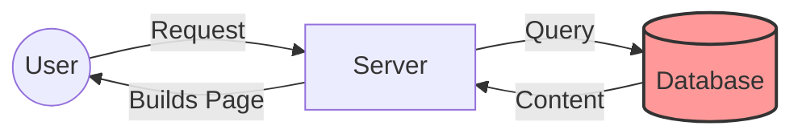
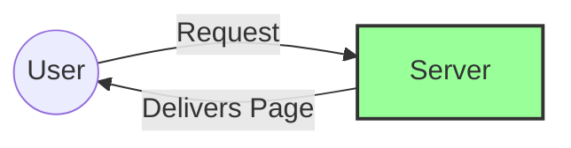

# Why We Built a Modern Site for Living on Earth

We are upgrading Living on Earth from `"The Old Way"` to `"The Modern Way"`. Here is why this matters to you.

## 1. Visualizing the Difference

**Imagine a user clicks a link to read a story...**

### 🔴 The Old Site (Dynamic)

It was a complex relay race every time someone visited a page.

* **Process**: The server has to "wake up", ask the database for text, find the design templates, glue them together, and *then* send it to you.
* **Result**: Slower, harder work for the server, and if the database has a hiccup, the whole site breaks.

### 🟢 The New Site (Static)

It is a simple hand-off. The work is already done.

* **Process**: The page was built once, text and design combined, before the user ever arrived. It's sitting there waiting.
* **Result**: Instant. Reliable. Cannot "crash" because there are no moving parts.

## 2. Reliability (Oral Tradition vs. The Printed Book)

* **The Old Site (Oral Tradition)**: Like a storyteller recounting a tale from memory, the old server has to "remember" and assemble every page from scratch each time someone visits. If the storyteller gets tired or forgets a detail (database crash), the story stops. It is fragile and labor-intensive.
* **The New Site (The Printed Book)**: We "print" the website once when we save our work. When a user visits, the page is already waiting for them, perfect every time. It cannot "crash" because there is no active effort required to show it. It just exists, solid and reliable.

## 3. Speed

* **Then**: 🐢 **Slow.** The server had to build the page from scratch for every single visitor.
* **Now**: 🐇 **Instant.** Because the pages are pre-built, they load immediately. This is crucial for listeners on mobile phones or slow connections.

## 4. Security

* **Then**: 🔓 **Vulnerable.** The old site had login screens and databases that hackers could try to break into.
* **Now**: 🔒 **Unhackable.** The new site has no database and no public login screen. It is just read-only text files. There is nothing to hack.

## 5. Ownership

* **Then**: ☁️ **trapped.** Your content was locked inside a complex database format. Moving to a new web host was a massive, expensive project.
* **Now**: 📂 **Freedom.** Every story is a simple text file (`.md`) that you can see, read, and back up on your own computer. You own your data forever. You can move to any web host in the world in 10 minutes.

## 6. Cost

* **Then**: 💰 **Expensive.** You paid for servers to run the database and the complex code 24/7.
* **Now**: 🆓 **Free.** Because the site is just simple files, it costs almost nothing to host.

## 7. The Editor Experience

What does this feel like for the person writing the stories?

* **The Old Way (HTML Forms)**:
  * **"Code" Heavy**: You often had to paste raw HTML code (`
paragraph
 `) into a small text box. One missing bracket could break the page layout.
  * **Online Only**: You had to be logged into the website to work. If your internet flickered while saving, you lost your work.
  * **No Undo**: If you accidentally deleted a paragraph and clicked "Save", it was gone forever.

* **The New Way (Markdown & Git)**:
  * **Human Readable**: You write in simple text. You use simple stars for **bold** or *italics*. It is as easy as writing an email.
  * **Work Anywhere**: You can write your stories offline on your laptop, on a plane, or in your favorite text editor.
  * **Time Travel**: Every time you save, we keep a permanent snapshot. You can go back to exactly how the file looked yesterday, last month, or last year. You can never "ruin" the site.

## Summary

| Feature | Old Site | New Site |
| :--- | :--- | :--- |
| **Complexity** | ❌ High (Fragile) | ✅ Low (Rock Solid) |
| **Speed** | ❌ Slower | ✅ Instant |
| **Security** | ❌ Vulnerable | ✅ Secure |
| **Cost** | ❌ High | ✅ Free / Low |
| **Control** | ❌ Vendor Lock-in | ✅ 100% Ownership |
| **Editing** | ❌ Raw Code / Risky | ✅ Human Text / Undo |
