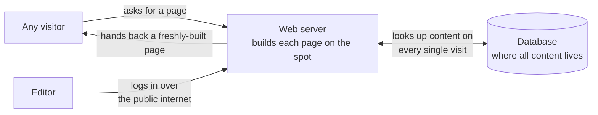
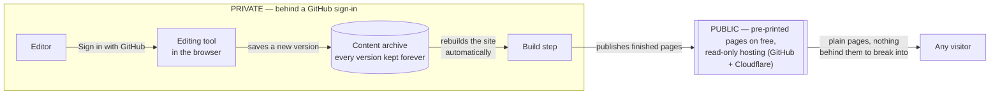

# Living on Earth — What We've Built and Why It Matters

This is a plain-English summary for the LOE team of what has been built, what it does, and why it matters for the show's future.

---

## The Core Idea: We Printed the Book Before the Library Opened

The old website worked like a printing press that waited for you to walk in before it printed anything. Every visitor triggered the machine from scratch. If one part of the machine broke down, nobody got their page.

The new site works differently. Every page is printed in advance and waiting on the shelf before anyone asks for it. There is no machine to break, no moving parts to fail. The pages just sit there, ready. Hosting costs nothing — we use free shelf space provided by GitHub and Cloudflare, two companies whose core business is exactly this kind of reliable file storage.

This isn't a technical distinction. It means the site will not go down. Not from a traffic spike, not from a software failure, not from someone forgetting to pay a bill.

---

## Two Pictures: How the Old Site and the New Site Are Built

It helps to see the difference. Here is the shape of a typical older website — the kind loe.org has historically been. Behind the scenes it's a program running on an always-on machine that builds each page from scratch out of a database every time someone visits.

```mermaid
flowchart LR
    Visitor["Any visitor"] -->|"asks for a page"| Server["Web server<br/>builds each page on the spot"]
    Server <-->|"looks up content on<br/>every single visit"| DB[("Database<br/>where all content lives")]
    Editor["Editor"] -->|"logs in over<br/>the public internet"| Server
    Server -->|"hands back a freshly-built page"| Visitor
```

Everything runs through one always-on machine. That machine builds every page on demand, holds the keys to the database, *and* hosts the editor login — all of it reachable from the public internet. It's powerful, but it's a lot of surface to defend, patch, and keep running.

Here is the new site. The editing side and the public side are completely separate, and the public side has no live machinery behind it at all:

```mermaid
flowchart LR
    subgraph private["PRIVATE — behind a GitHub sign-in"]
        Editor["Editor"] -->|"Sign in with GitHub"| CMS["Editing tool<br/>in the browser"]
        CMS -->|"saves a new version"| Repo[("Content archive<br/>every version kept forever")]
        Repo -->|"rebuilds the site<br/>automatically"| Build["Build step"]
    end
    Build -->|"publishes finished pages"| CDN[["PUBLIC — pre-printed pages on free,<br/>read-only hosting (GitHub + Cloudflare)"]]
    CDN -->|"plain pages, nothing<br/>behind them to break into"| Visitor["Any visitor"]
```

Visitors only ever touch finished, read-only pages sitting on file hosting. Editing happens somewhere else entirely, behind a login — and even there, no one is ever touching the public site directly.

### Why this is safer — in plain terms

- **There's no database or server sitting behind the public site.** The pages a visitor sees are just files. There's nothing to hack into, overload, or take down, because there's no live machinery there — only the printed result.
- **The production site has no login page at all.** The old model put the editor login on the same public address as the site. On the new site, the public address (vibingon.earth) has no "admin" door — there's nothing there to attack.
- **Editors sign in with GitHub — we never handle passwords.** "Sign in with GitHub" hands the password step to GitHub, one of the most heavily-guarded login systems in the world. Our site never sees, stores, or could leak an editor's password. It's the same idea as the "Sign in with Google" button you already use elsewhere.
- **Only named people can get in.** Signing in isn't enough — an editor also has to be on the project's explicit list of approved people. Anyone else who signs in is turned away at the door.
- **The worst case is small and reversible.** Even if someone got into the editing side, there's no database or server for them to reach, because there isn't one. The most they could do is propose a content change — and every change is recorded, attributed to a person, reversible, and previewed before it ever reaches the public site.

| | Old site | New site |
|---|---|---|
| The public site is… | a live program talking to a database | a shelf of finished pages |
| If it's attacked or overloaded… | the whole site can go down | nothing to take down — files just sit there |
| The editor login is… | on the public site, open to the internet | separate and private, via "Sign in with GitHub" |
| Passwords are… | handled (and stored) by the site | never seen by the site — GitHub handles them |
| A bad or mistaken change is… | potentially live, and hard to undo | recorded, reversible, and previewed first |

---

## Thirty-Five Years, All in One Place

The rebuild includes the complete Living on Earth archive: more than 10,000 segments and 1,600 shows, going back to 1991. Every episode, every transcript, every segment now has a permanent address on the internet.

For most of the show's history, older content existed somewhere but wasn't reliably findable. Now it's all there, all indexed, all connected. A listener who wants to find what LOE said about the Endangered Species Act in 1994 can find it.

---

## Editing: A Word Processor Where Every Draft Is Kept Forever

Editors use a browser-based tool that looks and works like a word processor. No code. No commands. You log in, you see your stories, you write and edit in a normal text interface, you save. That's it.

Every version of every story is kept permanently. Nothing can be accidentally deleted for good. If an editor wants to see what a story looked like three months ago, or undo a change from last week, that's possible. It works like "track changes" but for every single save, going back indefinitely.

---

## See It Before It Goes Out

When an editor saves a story, a preview copy appears at a private address in about two minutes. The editor can read it exactly as a listener would see it — fully formatted, with audio player, everything — before deciding to publish. Only after they approve does it go to the live site.

It's the difference between a rough proof and a finished page.

---

## A Researcher Who Read Every Transcript and Filed Everything

We defined a list of 90 topics — things like "climate policy," "biodiversity," "indigenous land rights," "nuclear energy." Then, for all 10,000+ segments in the archive, an automated process read each transcript and assigned it to the right topics from that list.

The result is a topic index of everything Living on Earth has ever covered, going back to 1991. Each topic has its own page showing every relevant segment across the decades, with a simple chart showing how much LOE has covered that topic over time. A listener curious about ocean acidification can find every segment LOE has ever done on it, in order.

New segments are classified automatically when they're published. No one has to maintain this by hand.

---

## A Name in a Transcript Becomes a Page

Every person who appears in LOE transcripts — hosts, reporters, guests, scientists — now has their own page on the site, built automatically from the transcripts themselves. These pages didn't require anyone to build a list or enter names into a form. The site figured out who appears and how often, and created the pages on its own.

A listener who wants to hear more from a particular scientist, or find every story a particular reporter filed, can do that now.

---

## A Copy Editor Who Reviews Every Story Before It Goes Out

Every time a story is published, an automated review runs quietly in the background. It checks for typos, looks for mismatches between a guest's name in the text and their name in the headline, and flags anything that looks off.

Editors don't have to do anything extra — they just save and publish as usual. But before the story reaches readers, something has checked it. Errors that used to slip through now get caught.

---

## "This Week in LOE History"

The homepage now has a section that automatically surfaces archive content from the same week in previous years. Every week it changes, pulling up relevant old stories and segments without anyone choosing them.

It gives longtime listeners a reason to explore what they missed. It reminds new listeners how long this show has been doing this work. And it happens on its own — no curation required.

---

## The Practical Stuff

A few smaller things that add up:

- **Station finder by zip code** — type in a zip code, get the nearest affiliate and how far away it is
- **Reading time and listening time** shown on every segment, so a listener knows what they're getting into
- **Clickable moments in transcripts** — a listener can jump directly to a specific exchange in an episode
- **Chaptered audio** — a new show plays as one continuous episode with tappable chapter markers on the player, so a listener can jump straight to the segment they want without loading a separate file for each
- **Dark mode** — the site follows whatever your phone or computer is already set to, and you can switch manually
- **Works on any phone** — every page is readable on a small screen without zooming or scrolling sideways

---

## What This Adds Up To

Three things, plainly:

**The site won't break.** There's nothing to break. It's a shelf of printed pages.

**Editors have a clean, safe workflow** — write in a familiar tool, preview before publishing, every version saved forever, errors caught before they go out.

**Thirty-five years of work is now findable.** The archive was always there. Now it's indexed by topic, by person, by date, and connected to current content. The show's history is no longer a filing cabinet in a back room — it's part of the living site.
